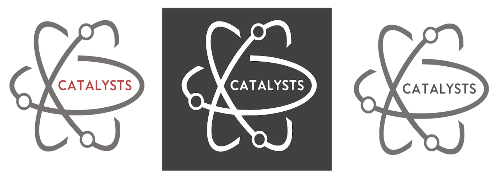
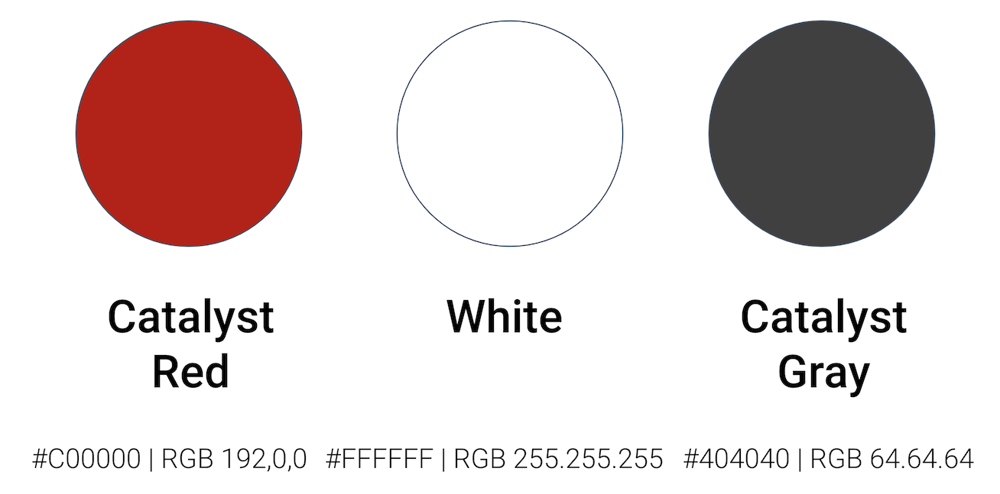
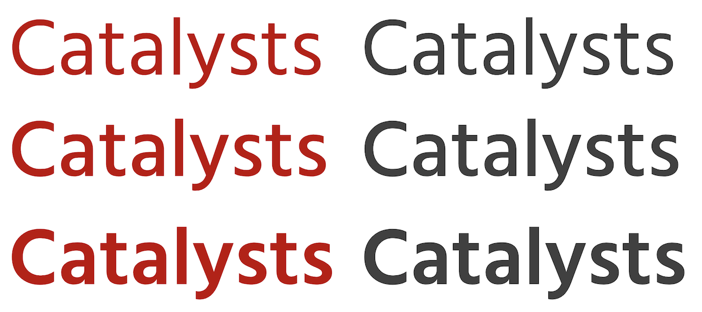
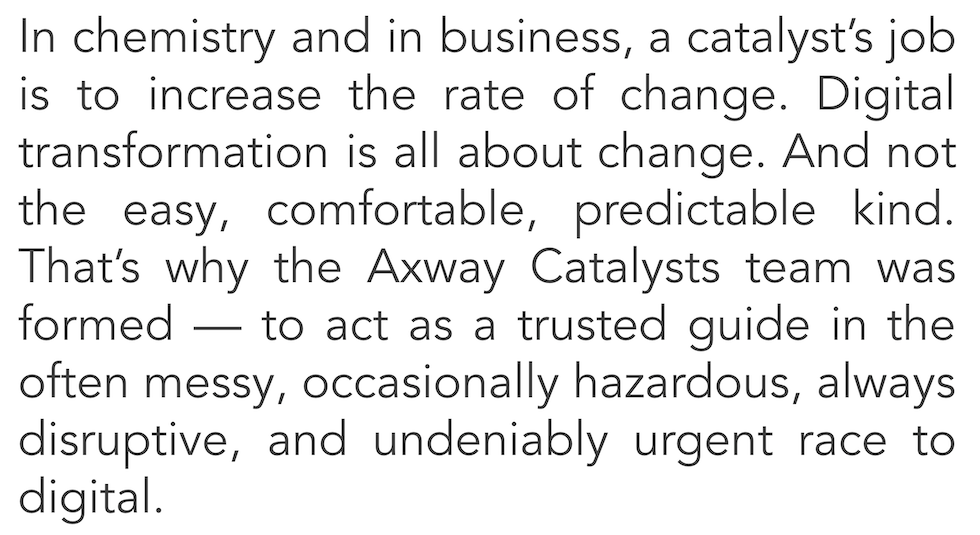

# The Catalysts – Brand Resources

Brands, like people, have their own personalities. Our brand is fearless and authentic, and our style is dynamic, scientific, and minimalist/modern. Every interaction with The Catalysts should reflect those core traits.

Here are all the building blocks for our brand.

## Logo

[Download Full-Color Light Version](./img/catalysts-logo.png)

[Download Dark Version](./img/catalysts-logo-white.png)

[Download Monochrome Version](./img/catalysts-logo-mono.png)

## Colors

## Typography

### Headlines: Frutiger

For headlines, titles of articles and slides. 

[Frutiger](https://www.linotype.com/1270238/frutiger-family.html) | [Hind (Google Font)](https://fonts.google.com/specimen/Hind)

## Text: Avenir

[Avenir](https://github.com/potyt/fonts/tree/master/macfonts/Avenir) | [Nunito (Google Font)](https://fonts.google.com/specimen/Nunito)

## Templates