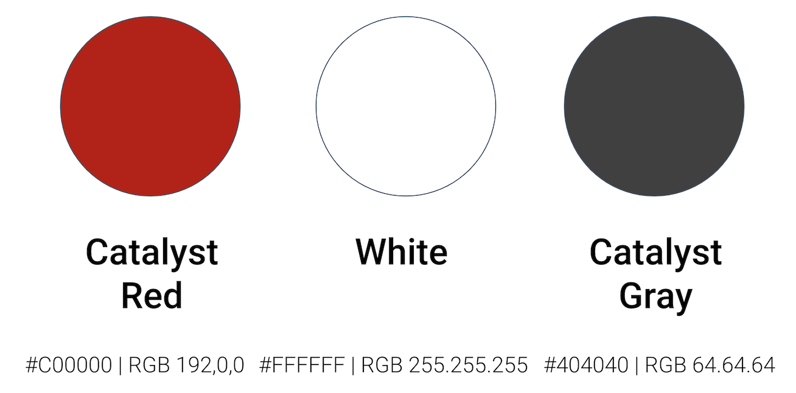
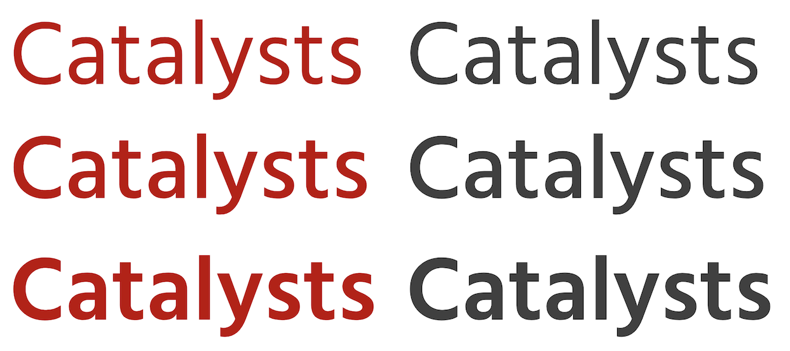
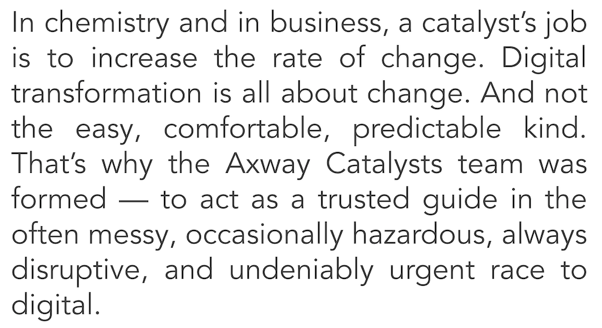

# The Catalysts – Brand Resources

Brands, like people, have their own personalities. Our brand is authentic, helpful, and brave. Every interaction with The Catalysts should reflect those core traits.

Here are all the building blocks for our brand.

## Logo

[Download Full-Color Light Version](catalysts-logo.png)

[Download Dark Version](catalysts-logo-white.png)

[Download Monochrome Version](catalysts-logo-mono.png)

## Colors

## Typography

### Headlines: Frutiger

For headlines, titles of articles and slides. 

[Frutiger](https://www.linotype.com/1270238/frutiger-family.html) | [Hind (Google Font)](https://fonts.google.com/specimen/Hind)

## Text: Avenir

[Avenir](https://github.com/potyt/fonts/tree/master/macfonts/Avenir) | [Avenir on Google Fonts](https://fonts.google.com/?query=Avenir)

## Templates